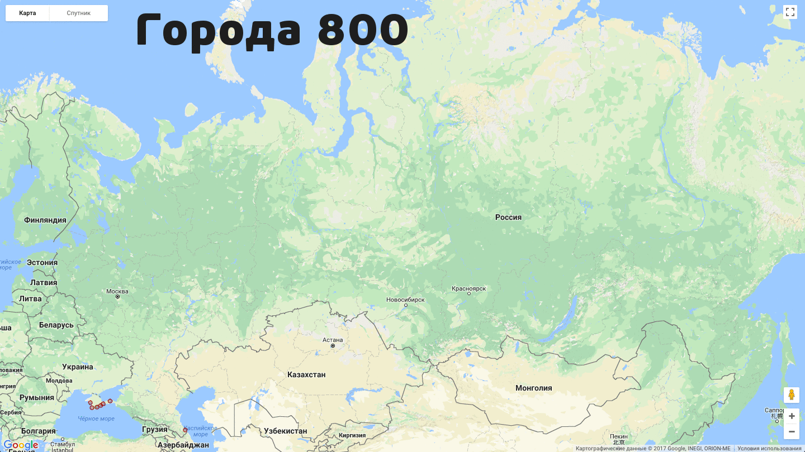
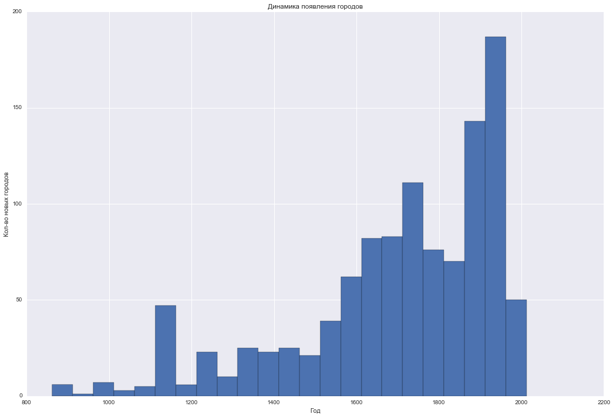
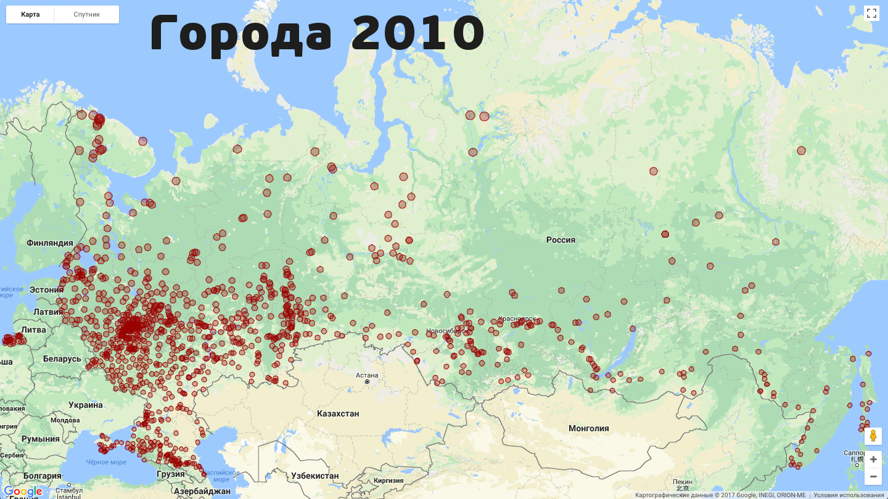

# GIF основания городов в России

Запилил анимацию с годами основания городов России, всего их сейчас 1113

Идея из telegram-канала [Городские данные](https://t.me/urbandata), там появилась похожая по США, вот и сделал для России.

За сутки GIF набрала в канале и где-то ещё 3.8k просмотров, я доволен)

Параллельно со мной свою версию прислал Александр Сивашёв, в ней можно и названия городов увидеть, и карту подвигать:
https://shyr1punk.github.io/city-visualization/

## Немного инсайтов

* С 1991 года было основано только 2 города: Иннополис (2012) и Магас (1995)
* в СССР же основывалось в среднем 3 города / год
* Россия гораздо меньше покрыта городами, чем я думал
* Градостроительный бум начался в 16-17 веках

## Как делал

* скопировал данные с [wiki](https://ru.wikipedia.org/wiki/Список_городов_России)
* почистил их (18 век -> 1750, ...)
* получил координаты каждого города с помощью геокодинга гугла
* с помощью библиотеки *gmplot* нагенерировал html-файл на каждый кадр
* bash-скриптом открывал каждый html, после 3 секунд спячки (пока прогрузится карта) делался скриншот
* python-скриптом обрезался кадр и наносилась надпись с номером года в отдельные картинки
* bash-скриптом картинки сохранил в gif, последнему кадру намеренно поставил большой delay, чтобы можно было рассмотреть текущую ситуацию